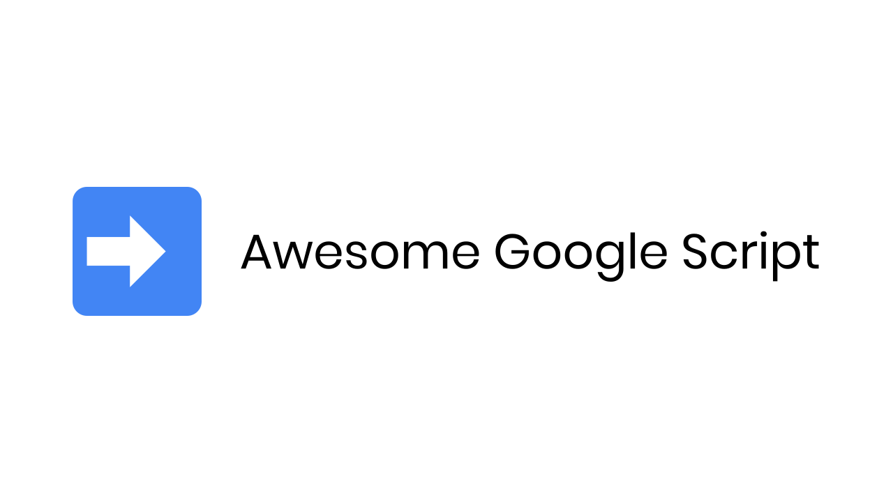

  
   
  
    
<a href="https://developers.google.com/apps-script/overview">Google Apps Script</a> is a platform that makes it easy to integrate with Google services.

## Contents

- [Articles](#articles)
- [Scripts](#scripts)

## Articles

- [Documentation](https://developers.google.com/apps-script/overview)

## Scripts

- [ImportJSON](https://github.com/bradjasper/ImportJSON) - Import JSON from any URL directly into your Google Sheets.
- [gs-require](https://github.com/Richienb/gs-require) - Use Node.js `require`.
- [googlescript-boilerplate](https://github.com/Richienb/googlescript-boilerplate) - Boilerplate to kickstart creating a project.
